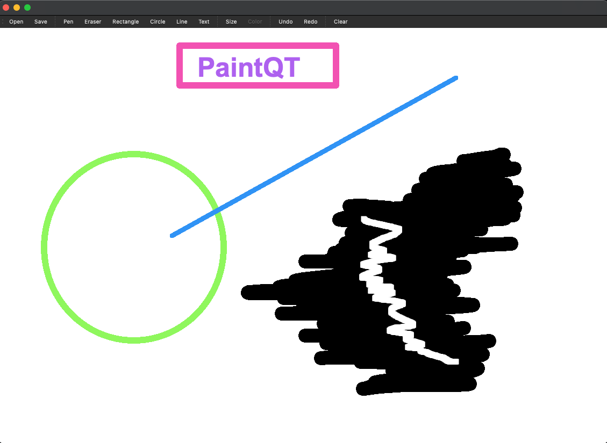
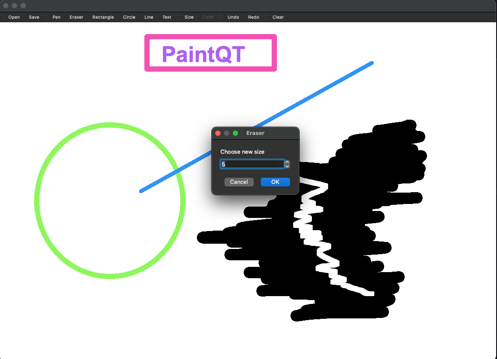
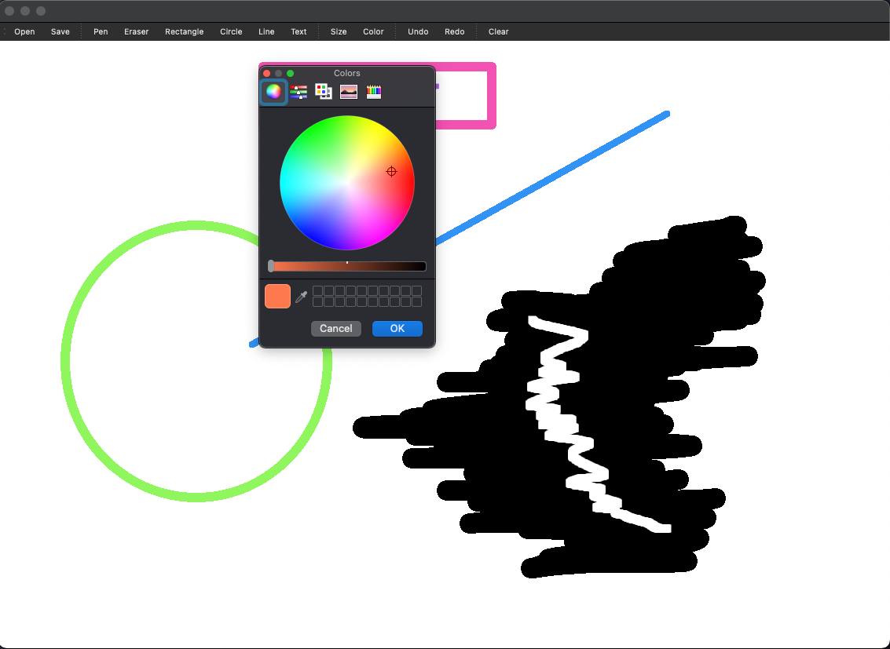
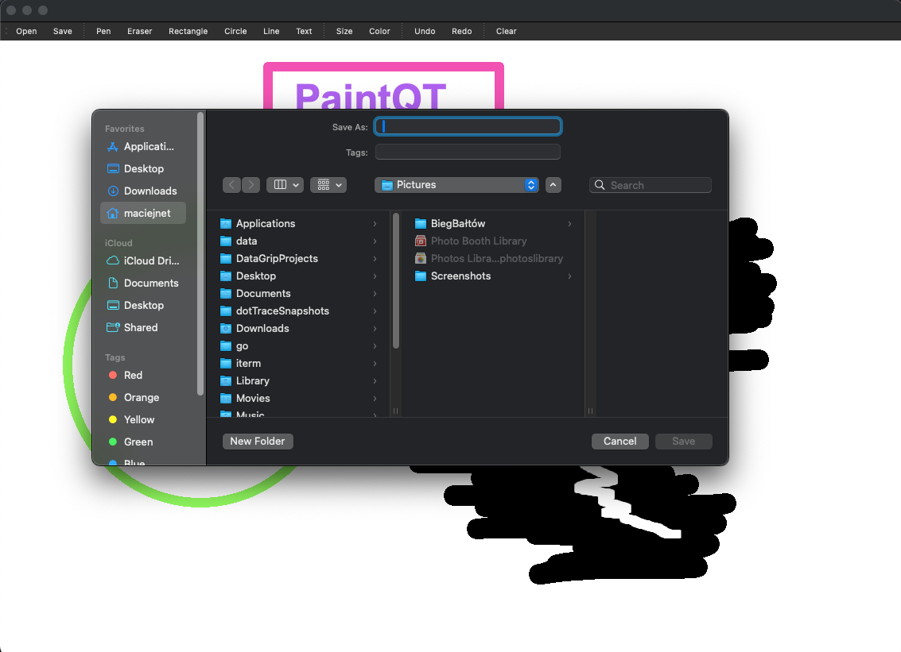

# PaintQt

## Overview

PaintQt is a Qt C++ desktop application that allows users to draw basic shapes like rectangles, lines, circles and add text to canvas. It also supports color picker, save and load file, undo/redo and clean canvas.

## Running the Application

### Prerequisites
To run the application you need to have qt, g++ compiler and CMake installed on your system.

### Build and run

```shell
mkdir build
cd build
cmake ..
cmake --build .
./PaintQt
```

### Screen shoots of running program



